# NIXTAP — Microservices Backend Platform

NIXTAP is an enterprise-grade digital networking platform built on a modern Spring Boot Microservices architecture. It provides digital business card management, NFC card pairing, profile customization, portfolio showcasing, appointment scheduling, real-time feedback, interactive analytics, notification delivery, and admin management.

---

## 🏗️ Architecture Overview

The backend ecosystem comprises **13 microservices** managed by Spring Cloud Eureka for Service Discovery and Spring Cloud Gateway for Centralized API Routing, Security, and Rate-Limiting.

```
                               ┌───────────────────────────────────┐
                               │           REACT FRONTEND          │
                               │          (localhost:3000)         │
                               └─────────────────┬─────────────────┘
                                                 │
                               ┌─────────────────▼─────────────────┐
                               │            API GATEWAY            │
                               │          (localhost:8080)         │
                               └─────────────────┬─────────────────┘
                                                 │
                     ┌───────────────────────────┴───────────────────────────┐
                     │          EUREKA SERVICE REGISTRY (8761)               │
                     └───────────────────────────┬───────────────────────────┘
                                                 │
 ┌───────────────────┬───────────────────┬───────┴───────────┬───────────────────┬───────────────────┐
 │   auth-service    │  profile-service  │ business-card     │ portfolio-service │    qr-service     │
 │      (:8081)      │      (:8082)      │  service (:8083)  │      (:8084)      │      (:8086)      │
 ├───────────────────┼───────────────────┼───────────────────┼───────────────────┼───────────────────┤
 │notification-serv. │ analytics-service │ feedback-service  │  meeting-service  │   admin-service   │
 │      (:8085)      │      (:8087)      │      (:8091)      │      (:8092)      │      (:8093)      │
 └───────────────────┴───────────────────┴───────────────────┴───────────────────┴───────────────────┘
                                         │   media-service   │
                                         │      (:8095)      │
                                         └───────────────────┘
```

---

## 🗄️ Microservices Database & Entity-Relationship (ER) Diagram

Each microservice manages its own decoupled database domain. Below is the comprehensive **Entity-Relationship Diagram (ERD)** across all NIXTAP microservice databases:

```mermaid
erDiagram
    %% Auth Service (auth_db)
    USERS {
        bigint id PK
        string email UK
        string password
        string full_name
        string role
        boolean is_enabled
        boolean is_email_verified
        string verification_code
        datetime created_at
        datetime updated_at
    }
    REFRESH_TOKENS {
        bigint id PK
        string token UK
        bigint user_id FK
        datetime expiry_date
    }
    PASSWORD_RESET_TOKENS {
        bigint id PK
        string token UK
        bigint user_id FK
        datetime expiry_date
    }
    USERS ||--o{ REFRESH_TOKENS : "issues"
    USERS ||--o{ PASSWORD_RESET_TOKENS : "generates"

    %% Profile Service (profile_db)
    USER_PROFILES {
        bigint id PK
        bigint user_id UK
        string bio
        string title
        string phone
        string address
        string avatar_url
    }
    SOCIAL_LINKS {
        bigint id PK
        bigint profile_id FK
        string platform
        string url
    }
    CONTACT_DOWNLOADS {
        bigint id PK
        bigint profile_id FK
        string visitor_ip
        datetime downloaded_at
    }
    USER_PROFILES ||--o{ SOCIAL_LINKS : "contains"
    USER_PROFILES ||--o{ CONTACT_DOWNLOADS : "tracks"

    %% Business Card Service (biz_card_db)
    BUSINESS_CARDS {
        bigint id PK
        bigint user_id FK
        string card_title
        string company_name
        string designation
        string card_color
        string card_slug UK
    }
    NFC_TAGS {
        bigint id PK
        string tag_uid UK
        bigint card_id FK
        boolean is_active
    }
    THEMES {
        bigint id PK
        string theme_name
        string primary_color
        string background_style
    }
    USER_THEME_SELECTIONS {
        bigint id PK
        bigint user_id FK
        bigint theme_id FK
    }
    BUSINESS_CARDS ||--o{ NFC_TAGS : "linked_to"
    THEMES ||--o{ USER_THEME_SELECTIONS : "applied_by"

    %% Portfolio Service (portfolio_db)
    PROJECTS {
        bigint id PK
        bigint user_id FK
        string title
        string description
        string project_url
        string image_url
    }
    SKILLS {
        bigint id PK
        bigint user_id FK
        string skill_name
        string proficiency_level
    }
    EXPERIENCES {
        bigint id PK
        bigint user_id FK
        string company
        string role
        string start_date
        string end_date
    }
    EDUCATION {
        bigint id PK
        bigint user_id FK
        string institution
        string degree
        string field_of_study
    }
    AWARDS {
        bigint id PK
        bigint user_id FK
        string title
        string issuer
        string year
    }
    CERTIFICATES {
        bigint id PK
        bigint user_id FK
        string name
        string authority
        string issue_date
    }

    %% QR Service (qr_db)
    QR_CODES {
        bigint id PK
        bigint user_id FK
        string qr_slug UK
        string target_url
        int scan_count
    }

    %% Analytics Service (analytics_db)
    ANALYTICS_EVENTS {
        bigint id PK
        bigint user_id FK
        string event_type
        string source_ip
        datetime timestamp
    }

    %% Meeting Service (meeting_db)
    MEETING_REQUESTS {
        bigint id PK
        bigint host_user_id FK
        string visitor_name
        string visitor_email
        datetime meeting_time
        string status
    }

    %% Feedback Service (feedback_db)
    FEEDBACK {
        bigint id PK
        bigint target_user_id FK
        string reviewer_name
        string comments
        int rating
    }

    %% Notification Service (notif_db)
    NOTIFICATION_LOGS {
        bigint id PK
        bigint user_id FK
        string recipient_email
        string subject
        string status
    }
    NOTIFICATION_PREFERENCES {
        bigint id PK
        bigint user_id UK
        boolean email_enabled
    }

    %% Media Service (media_db)
    MEDIA_FILES {
        bigint id PK
        bigint user_id FK
        string file_name
        string file_type
        string file_path
        long file_size
    }

    %% Admin Service (admin_db)
    ADMIN_AUDIT_LOGS {
        bigint id PK
        bigint admin_user_id FK
        string action
        string target_entity
        datetime timestamp
    }
```



---

## 🧩 Microservices Directory & Port Mapping

| Service Name | Port | Database | Primary Responsibility |
| :--- | :---: | :---: | :--- |
| **Eureka Server** | `8761` | — | Central Service Registration & Health Monitoring |
| **API Gateway** | `8080` | — | Request Routing, CORS Management & Gateway Filters |
| **Auth Service** | `8081` | `auth_db` | Authentication, User Registration, JWT Issuance & Refresh Tokens |
| **Profile Service** | `8082` | `profile_db` | User Profiles, Personal Information & Social Link Management |
| **Business Card Service** | `8083` | `biz_card_db` | Digital Card Customization, NFC Tag Management & Themes |
| **Portfolio Service** | `8084` | `portfolio_db` | Project Portfolios, Work Showcase & Skills Management |
| **Notification Service** | `8085` | `notif_db` | Email & System Alert Notifications |
| **QR Service** | `8086` | `qr_db` | QR Code Generation & Scan Tracking |
| **Analytics Service** | `8087` | `analytics_db` | Profile & Card Views Tracking, Engagement Metrics |
| **Feedback Service** | `8091` | `feedback_db` | Client Reviews, Testimonials & Ratings |
| **Meeting Service** | `8092` | `meeting_db` | Appointment Scheduling, Availability & Booking |
| **Admin Service** | `8093` | `admin_db` | Platform Administration, User Audits & Management |
| **Media Service** | `8095` | `media_db` | Image/Asset Uploads & Storage Management |

---

## 🛠️ Prerequisites & Technology Stack

* **Java**: JDK 17 or JDK 21
* **Build Tool**: Apache Maven (3.8+)
* **Database**: MySQL 8.x
* **Framework**: Spring Boot 3.x, Spring Cloud (2023.x)
* **Security**: Spring Security, JWT (JSON Web Tokens), BCrypt Password Hashing

---

## ⚙️ Database Configuration

Ensure MySQL is installed and running locally on port `3306`. Each microservice manages its own dedicated database. You can manually create the databases or let Spring Data JPA auto-create them on boot:

```sql
CREATE DATABASE IF NOT EXISTS auth_db;
CREATE DATABASE IF NOT EXISTS profile_db;
CREATE DATABASE IF NOT EXISTS biz_card_db;
CREATE DATABASE IF NOT EXISTS portfolio_db;
CREATE DATABASE IF NOT EXISTS notif_db;
CREATE DATABASE IF NOT EXISTS qr_db;
CREATE DATABASE IF NOT EXISTS analytics_db;
CREATE DATABASE IF NOT EXISTS feedback_db;
CREATE DATABASE IF NOT EXISTS meeting_db;
CREATE DATABASE IF NOT EXISTS admin_db;
CREATE DATABASE IF NOT EXISTS media_db;
```

---

## 🚀 Environment Variables

Set the following environment variables (or rely on script defaults):

| Variable | Recommended Default | Description |
| :--- | :--- | :--- |
| `DB_USERNAME` | `root` | MySQL Database Username |
| `DB_PASSWORD` | `YourPassword` | MySQL Database Password |
| `JWT_SECRET` | `404E635266556A586E3272357538782F413F4428472B4B6250645367566B5970` | HMAC-SHA256 Secret Key |

---

## 🏁 Quick Start & Deployment Guide

### 1. Build All Microservices
To compile and package all microservices into `.jar` files using Maven:

**PowerShell:**
```powershell
.\build-all.ps1
```

Or manually in each service directory:
```bash
mvn clean package -DskipTests
```

### 2. Launch All Microservices
You can launch the complete backend ecosystem in automated sequence:

**PowerShell:**
```powershell
.\start_all.ps1
```
*or using background process launcher:*
```powershell
.\launch-backend-all.ps1
```

**Batch (Windows Command Prompt):**
```cmd
start_all.bat
```

### 3. Service Verification & Eureka Dashboard
* **Eureka Service Discovery Dashboard**: Open [http://localhost:8761](http://localhost:8761) to confirm all microservices are registered.
* **API Gateway Entry Point**: Base URL [http://localhost:8080](http://localhost:8080)

---

## 🔒 Security Architecture

1. **Authentication Flow**:
   * Users register at `/api/v1/auth/register` and login at `/api/v1/auth/login`.
   * Upon authentication, the Auth Service issues a signed **JWT Access Token** (expires in 24 hours) and a **Refresh Token** (expires in 7 days).
2. **Stateless Authorization**:
   * The API Gateway routes incoming requests to downstream services.
   * Microservices validate JWT signatures statelessly using their embedded `JwtAuthenticationFilter`.
3. **Role-Based Access Control (RBAC)**:
   * Endpoints enforce authority roles (`ROLE_USER`, `ROLE_ADMIN`).

---

## 📜 API Route Map (Gateway: `http://localhost:8080`)

| Subpath | Target Microservice | Description |
| :--- | :--- | :--- |
| `/api/v1/auth/**` | `auth-service:8081` | Registration, Login, Token Refresh |
| `/api/v1/profiles/**` | `profile-service:8082` | Profiles & Social Links |
| `/api/v1/cards/**` | `business-card-service:8083` | Digital Cards & Themes |
| `/api/v1/portfolio/**` | `portfolio-service:8084` | User Portfolios |
| `/api/v1/notifications/**` | `notification-service:8085` | User Alerts |
| `/api/v1/qr/**` | `qr-service:8086` | QR Generation & Analytics |
| `/api/v1/analytics/**` | `analytics-service:8087` | Platform Analytics |
| `/api/v1/feedback/**` | `feedback-service:8091` | Reviews & Ratings |
| `/api/v1/meetings/**` | `meeting-service:8092` | Booking & Calendars |
| `/api/v1/admin/**` | `admin-service:8093` | Admin Tools |
| `/api/v1/media/**` | `media-service:8095` | Media Uploads |

---

## 📄 License

Internal / Proprietary project for **NIXTAP Platform**.
